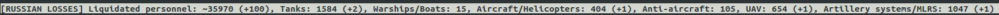

# Russian Losses in Ukraine [Vim statusline]
Silly Vimscript + Python to parse today's information about the russian losses during the war in Ukraine, and represent in the Vim status line. 

All information parses from [this website](https://index.minfin.com.ua/ua/russian-invading/casualties/) and transforms into categories provided by the General Staff of the Ukrainian Armed Forces ([example](https://twitter.com/GeneralStaffUA/status/1543474012709339136)).

## Demo 
Example of the plugin appearance in the standard Vim: 


and with the following categories:
```
self._include = [
    "Liquidated personnel",
    "Tanks",
    "Warships/Boats",
    "Aircraft/Helicopters",
    "Anti-aircraft",
    "UAV",
    "Artillery systems/MLRS",
]
```
## QA
### Is it stable?
No, it's not. We are parsing information from the 3rd side sources, so it can break anytime. It's my first and probably the last Vim/VimScript related project. Therefore no guarantees it even can be installed by the instructions below.

## Installation 

I have no idea what's the best practices of the Vim plugins...

1. Clone this repo.
2. I've used `pathogen` as a vim-plugin manager:
```
cd ~/.vim/bundle
ln -s ~/RussianLossesInUkraine/ .
```
3. Install `requirements.txt` dependencies to the virtual environment:
```
cd ~/RussianLossesInUkraine/plugin
virtualenv env
pip install -r requirements.txt
```
4. Edit the [second line](plugin/losses.vim#L2) in the `~/RussianLossesInUkraine/plugin/losses.vim`, and specify your path to the `site-packages` in the virtual eniveronment. Sorry...
